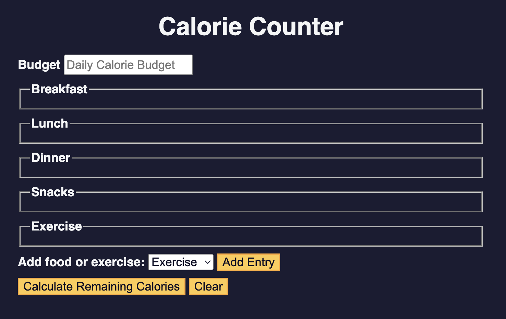

# freeCodeCamp JavaScript Algorithms and Data Structures - Calorie Counter

This is a project in the [Learn Basic JavaScript Algorithms and Data Structures](https://www.freecodecamp.org/news/learn-javascript-with-new-data-structures-and-algorithms-certification-projects/).

## Table of contents 😌

- [Overview](#overview)
  - [The project](#the-project)
  - [Screenshot](#screenshot)
  - [Links](#links)
- [My process](#my-process)
  - [Built with](#built-with)
  - [What I learned](#what-i-learned)
  - [Continued development](#continued-development)
  - [Code snippets](#im-really-proud-of-these-code-snippets%EF%B8%8F)
  - [Useful resources](#useful-resources)
- [Author](#author)
- [Acknowledgments](#acknowledgments)

## Overview👋🏾

Welcome to the #<sup>2nd</sup> project of the course! While I already earned my certification, I thought it would be fun to go through the course again since its just been revamped. You can now learn JavaScript by building 21 projects, and I will be detailing each one 😊.

### The project😥

In this project users will be able to:

- Validate user input, perform calculations based on that input, and dynamically update your interface to display the results. 
- This project covers basic regular expressions, template literals, the addEventListener() method, and more.

<!-- ### Screenshot🌇

 -->

<!-- ### Links👩🏾‍💻

- Live Site URL: (https://frolicking-biscotti-f94d2f.netlify.app/) -->

<!-- ## My process💭

This is a simple project that I started by marking out initial structure, classes, and id's in HTML. Next I finalized the UI by styling the CSS. I styled both the light and dark modes, the clock hands, and the digital output as well as the date section. I then added functionality by way of JavaScript to switch between light and dark modes when the user clicks on the button. I also made the clock hands functional by utilizing the Date() constructor, and mapped the range of hours minutes and seconds to 360 degrees in order to make the analog clock functional. -->

<!-- ### Built with👷🏾‍♀️

- Semantic HTML5 markup
- CSS custom properties
- Flexbox
- JavaScript -->

<!-- ### What I learned👩🏾‍🏫

I learned the logic behind making a simple progress bar functional. I will be applying this to future projects where needed.

I also learned that when using the before or after selectors you MUST add content for the style to be visible. -->

<!-- ### Continued development🔮

In the future I plan on continuing to practice positioning elements using flexbox, and using different selectors such as nth of type to select elements.

I also plan on continuing to practice using event listeners to make my pages more functional.

I also plan on continuing to learn the best ways to phrase git commits, so that future viewers can fully understand the changes that have occurred. -->

<!-- ### I'm really proud of these code snippets✂️

```css
.progress-container::before {
  content: '';
  background-color: var(--line-border-empty);
  position: absolute;
  top: 50%;
  left: 0;
  transform: translateY(-50%);
  height: 4px;
  width: 100%;
  z-index: -1;
}
```

```js
next.addEventListener('click', () => {
  currentActive++;

  if (currentActive > circles.length) {
    currentActive = circles.length;
  }
  update();
});

prev.addEventListener('click', () => {
  currentActive--;

  if (currentActive < 1) {
    currentActive = 1;
  }
  update();
});
``` -->

<!-- ### Useful resources📖

- [Resource](https://www.freecodecamp.org/news/how-to-write-better-git-commit-messages/) - This is an amazing article which helped me write better commit messages. I'd recommend it to anyone still learning this concept. -->

## Author🔎

- Website - [Portfolio Site](https://maiannethornton.netlify.app/)
- Frontend Mentor - [@MaianneThornton](https://www.frontendmentor.io/profile/MaianneThornton)
- GitHub - [@MaianneThornton](GitHub.com/MaianneThornton)
- Twitter - [@MaianneThornton](https://twitter.com/MaianneThornton)
- LinkedIn - [@MaianneThornton](https://www.linkedin.com/in/maiannethornton/)

<!-- ## Acknowledgments🙏🏾

Special Thanks go to [Brad Traversy](http://www.traversymedia.com/) and [Florin Pop](http://www.florin-pop.com/) creating the course and making reviewing concepts fun 😊. -->
